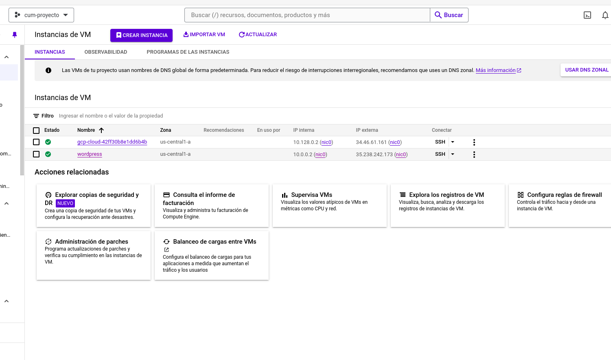

# Prueba Practica

Acontinuacion se encontrara en cada carpeta las 
tareas para la parte practica 

- tarea 1 en /task_1
- tarea 2 en /task_2
- tarea 3 en /task_3

Cada carpeta contendra su propio readme que indicara el
paso a paso para desarrolar cada una de las tareas.

Aca se resumira cada una y que tecnologais se usaron

## Tarea 1

Se implementa Terraform para desplegar la infrastructura
como codifo para facilitar su creacion y destrucion.

## Tarea 2

Se implementa Terraform para desplegar la infrastructura
como codifo para facilitar su creacion y destrucion.

## Tarea 3

Se adjuntan pantallazos y los pasos para resolver cada uno 
de los problemas en los entornos de ejecucion. 

